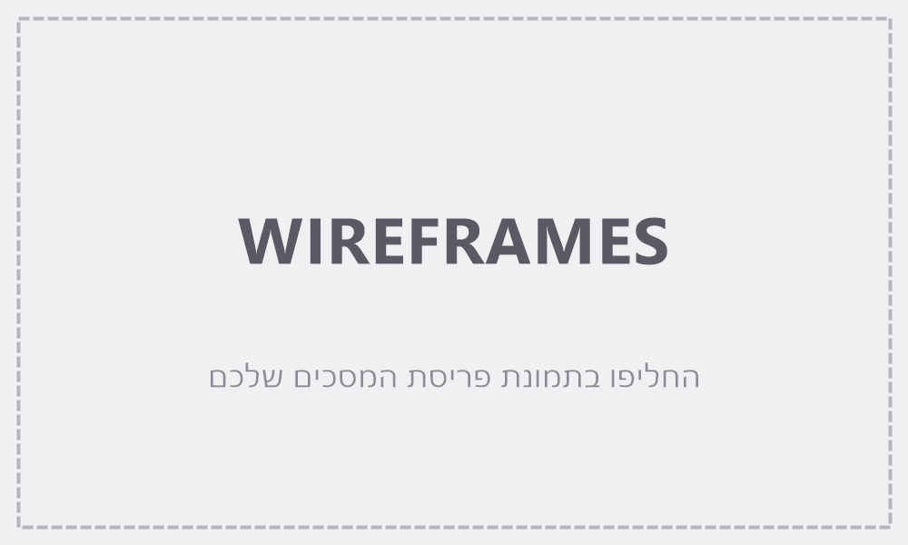
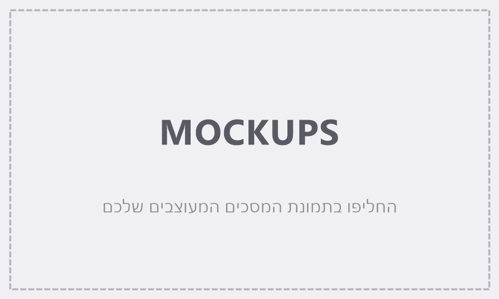
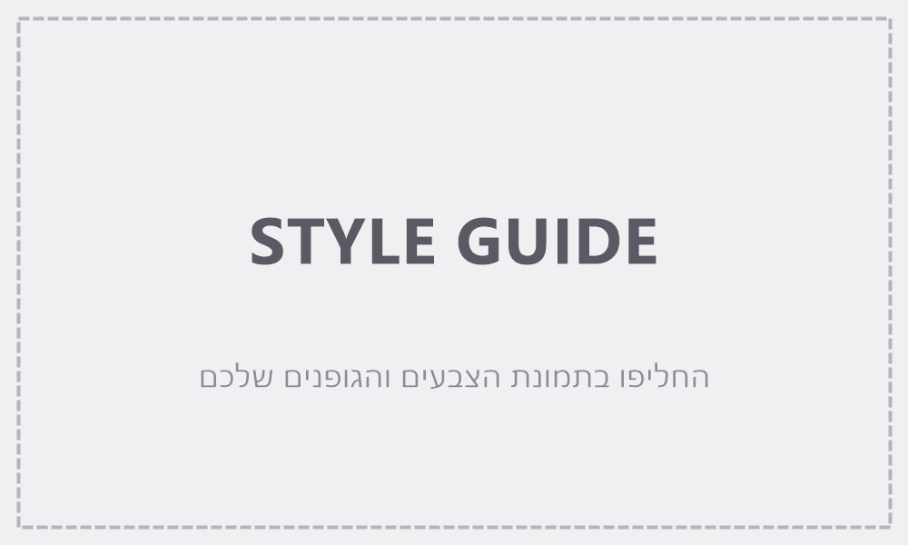

# Design (UI / UX)

> איך האפליקציה נראית ואיך המשתמשים נעים בתוכה. לקובץ זה שני חלקים: ה-**Screens** (מסכים) וה-**Style Guide**. תמונות הייחוס נמצאות באותה תיקיית `spec/`.

## חלק 1 — מסכים (Screens)

> תאר כל מסך בשפה פשוטה. הפנה לתמונות שלמטה.

### Wireframes (מבנה ופריסה)


### המראה הסופי (Mockups)


### רשימת המסכים
> רשומה אחת לכל מסך.

#### דף הבדיחות (המסך היחיד)
- **מטרה:** לייצר ולקרוא בדיחה, עם או בלי נושא.
- **מה יש בו:**
  - כותרת קצרה.
  - תיבת טקסט אחת לנושא (placeholder מסביר שהנושא אינו חובה).
  - כפתור ראשי אחד: "צור בדיחה".
  - אזור להצגת הבדיחה מתחת לכפתור.
  - חיווי טעינה בזמן היצירה, והודעת שגיאה ידידותית בעת כשל.
- **מה קורה:** לחיצה על "צור בדיחה" שולחת את תוכן התיבה לשרת ומציגה את הבדיחה שחוזרת. לחיצה נוספת מחליפה את הבדיחה בחדשה (באותו נושא אם יש טקסט בתיבה). תיבה ריקה → בדיחה רנדומלית.

### ניווט (איך המסכים מתחברים)
```
דף הבדיחות (מסך יחיד — אין ניווט)
```

---

## חלק 2 — Style Guide



> סגנון נקי ומינימלי, CSS בכתב יד, ללא ספריות עיצוב.

### צבעים (Colors)
| תפקיד | צבע (hex) |
|-------|-----------|
| Primary (כפתורים ראשיים, קישורים) | `#4f46e5` |
| רקע (Background) | `#f7f7fb` |
| טקסט (Text) | `#1f2937` |
| הדגשה (Accent) | `#6366f1` |
| שגיאה (Error) | `#dc2626` |

### גופנים (Fonts)
- **כותרות:** system-ui / sans-serif (ברירת מחדל של המערכת)
- **טקסט גוף:** system-ui / sans-serif

### מראה ותחושה
- **פינות:** מעט מעוגלות (כרטיס וכפתור).
- **אווירה כללית:** נקי ומינימלי — כרטיס לבן ממורכז על רקע בהיר, מרווחים נדיבים, אלמנט פעולה אחד בולט.
